# Evently App 📅 🚀

Evently is a powerful, feature-rich event management application built with Flutter and Firebase. It offers a seamless experience for creating, discovering, and interacting with events through real-time updates and interactive maps.

## ✨ Key Features
- **Smooth Onboarding & Splash**: Professional Splash Screen and interactive     Onboarding walkthrough to guide new users.
- **Local Data Persistence**: Integrated **Shared Preferences** to save user preferences (Theme, Language, and Onboarding status) locally for a seamless return experience.
- **Interactive Map Experience**: 
  - Browse events on Google Maps.
  - Smooth camera animations to event locations.
  - Custom Markers for different event categories.
- **Real-time Event Management**: 
  - CRUD operations (Create, Read, Update, Delete) using Firestore.
  - Live filtering by category.
- **Personalized Profile & Settings**:
  - **Dynamic Theming**: Toggle between Light and Dark modes.
  - **Localization**: Full support for English and Arabic.
  - Account management and secure Logout.
- **Favorites System**: Save and search through your favorite events.
- **Responsive & Animated UI**: Uses `ScreenUtil` for scaling and `AnimatedToggle` for smooth transitions.

## 🛠 Tech Stack

- **Framework**: [Flutter](https://flutter.dev)
- **Backend**: Firebase (Auth, Firestore).
- **Maps**: `Maps_flutter` & `location`.
- **State Management**: `Provider`.
- **UI Enhancements**: 
  - `animated_toggle_switch`
  - `flutter_screenutil`
  - `google_fonts`
  - `toastification`

## 📂 Project Structure Highlights
- `lib/features/main_layout`: The core shell of the app containing Home, Map, Favorites, and Profile.
- `lib/features/map`: Logic for rendering events on Google Maps and handling location permissions.
- `lib/core/widgets`: Reusable custom UI components like `DotWidget`, `EventCard`, and `CustomTextFormField`.
- `lib/config/providers`: State logic for Language and Theme settings.

## 📸 Screenshots

  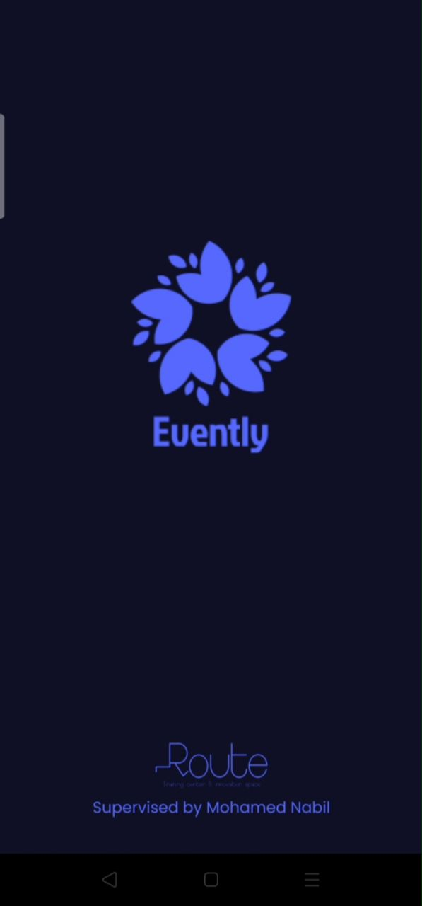
  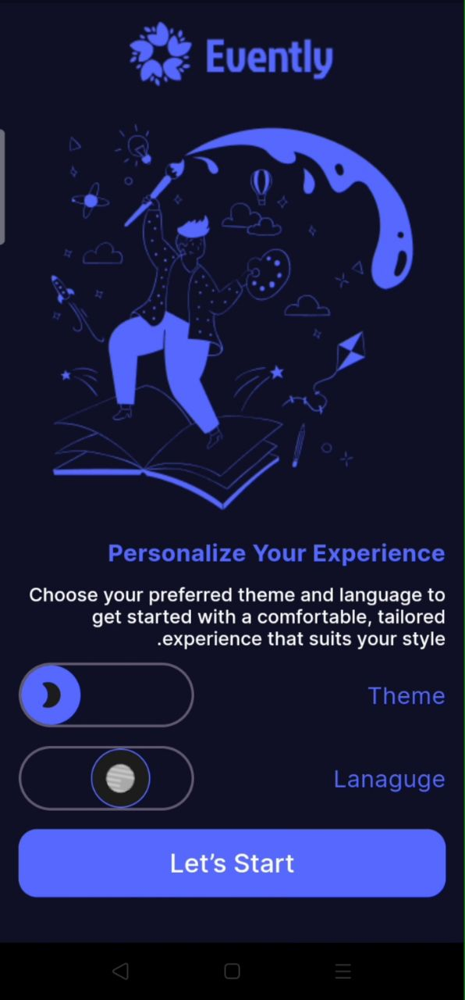
  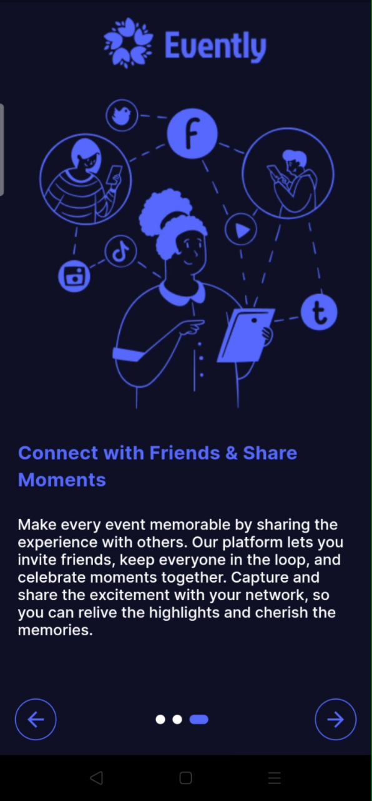
  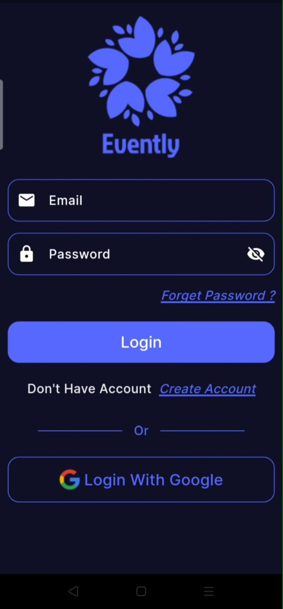
  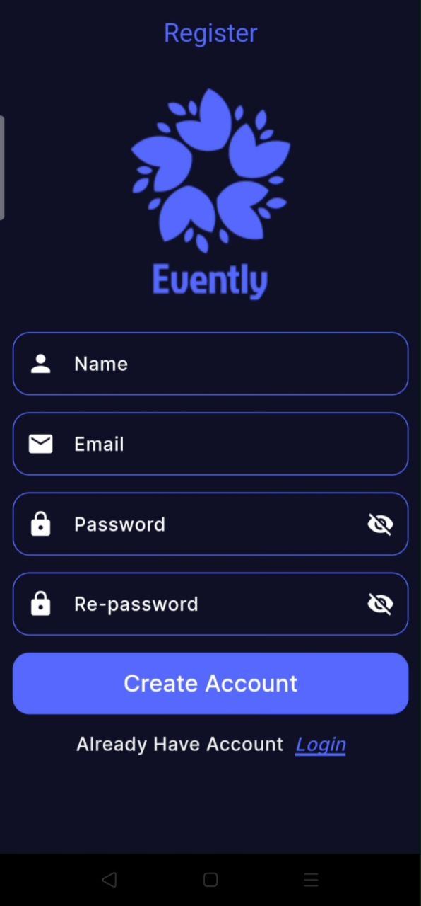
  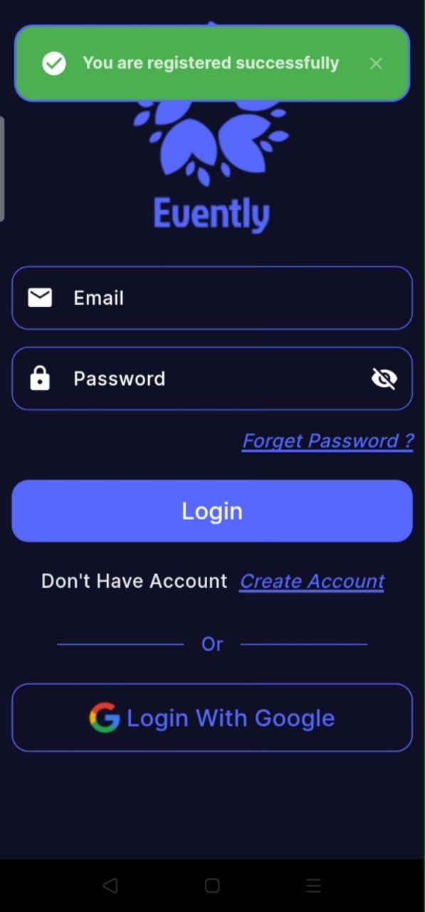
  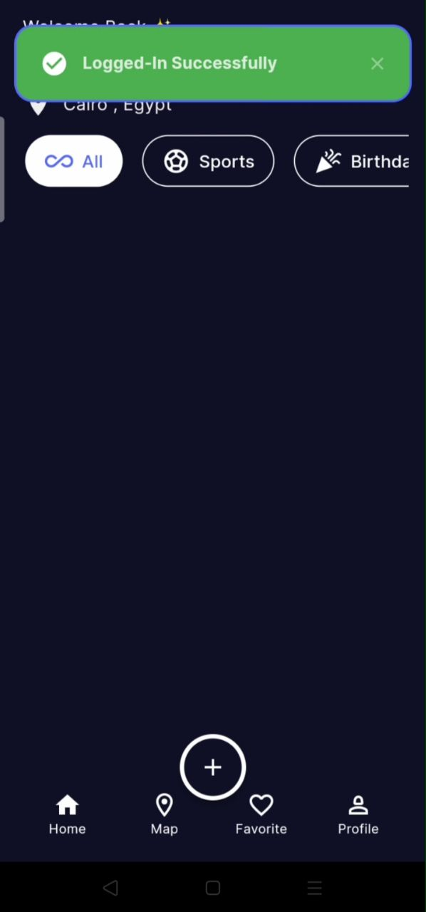
  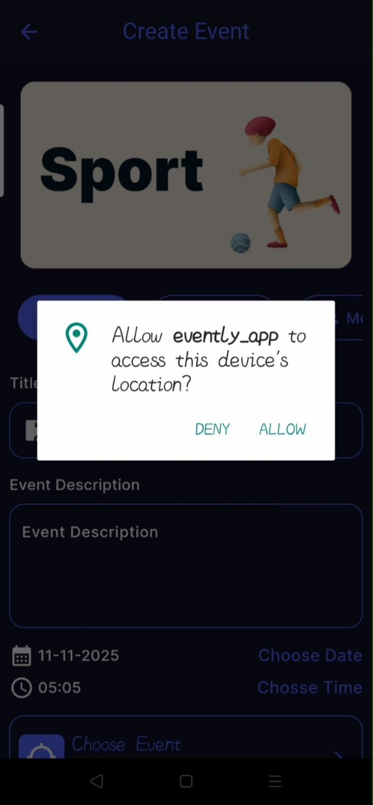
  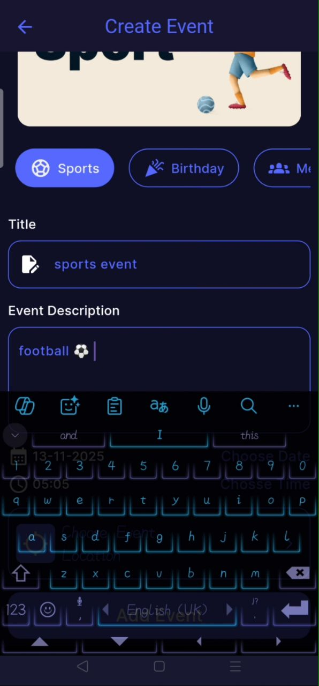
  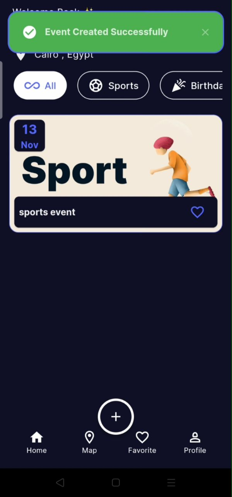
  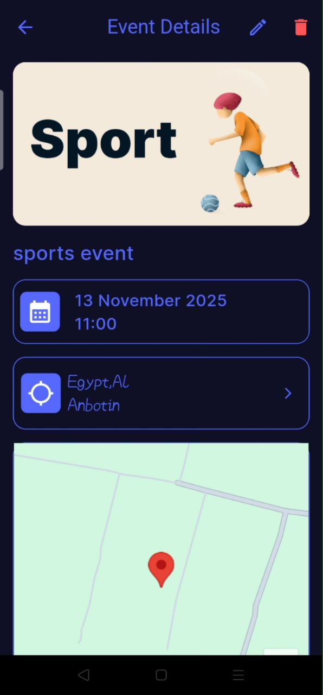
  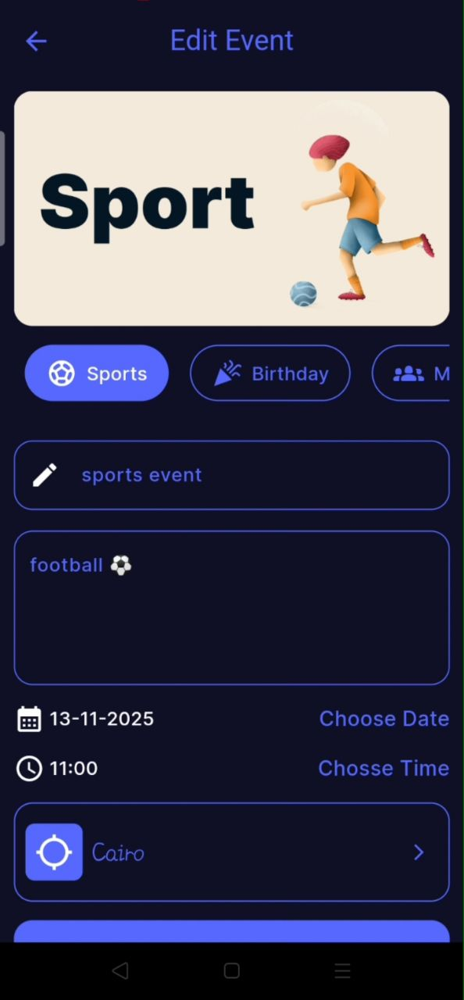
  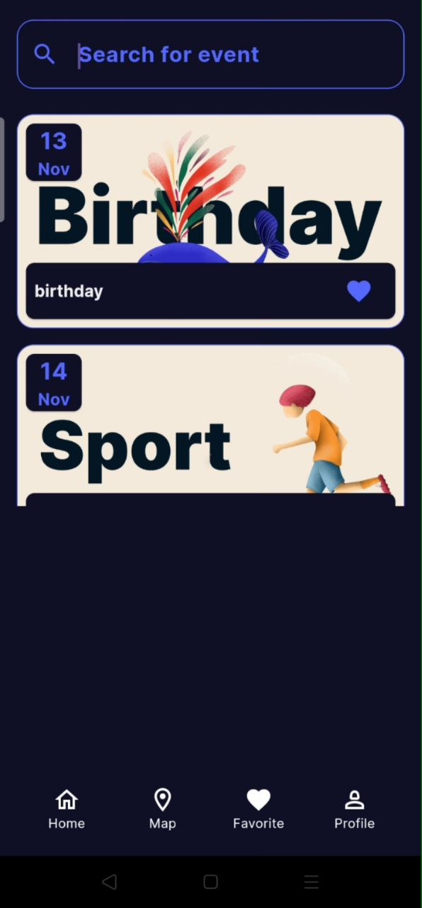
  
  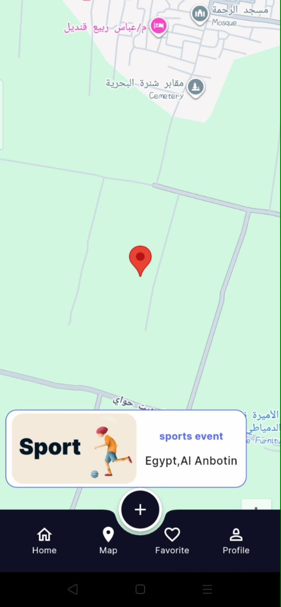
  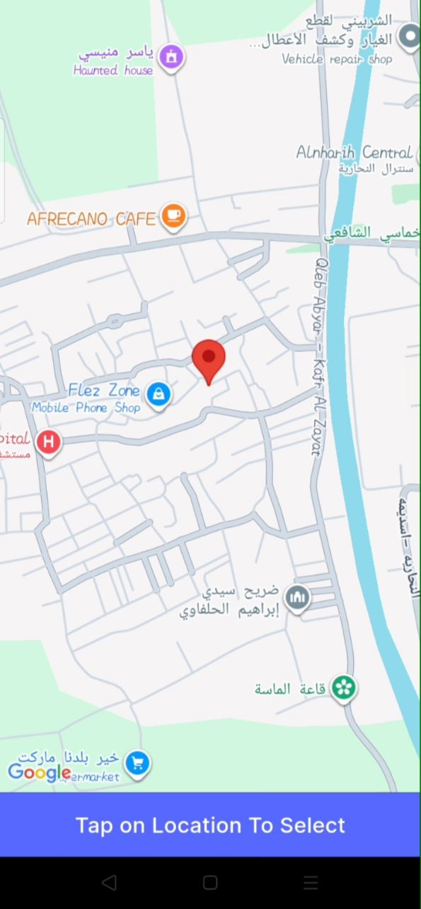
  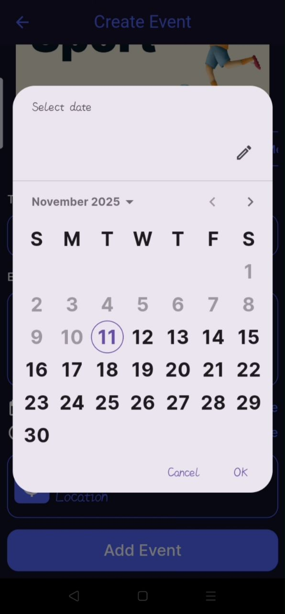
  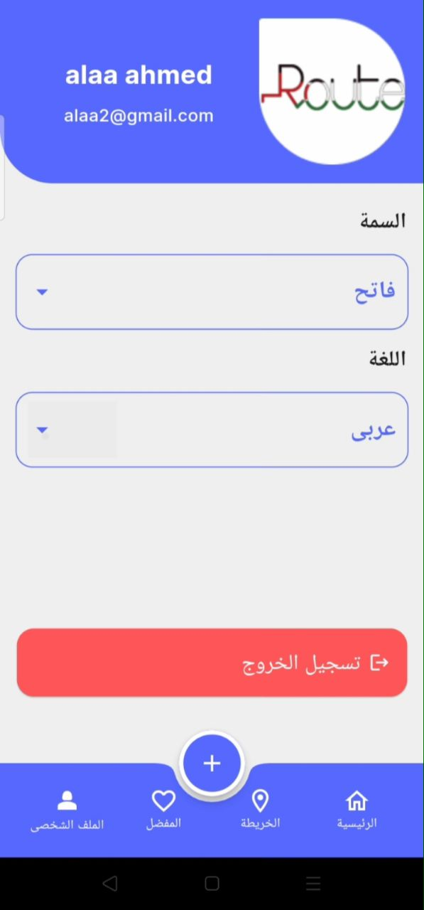
  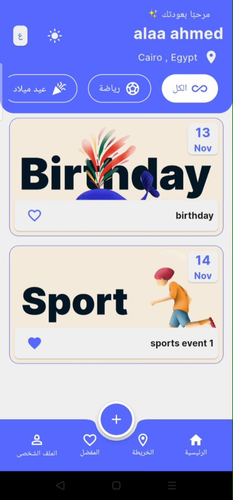
  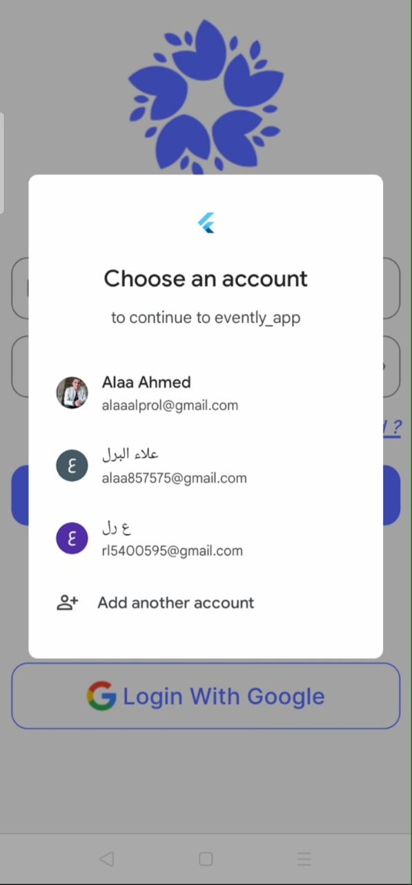

